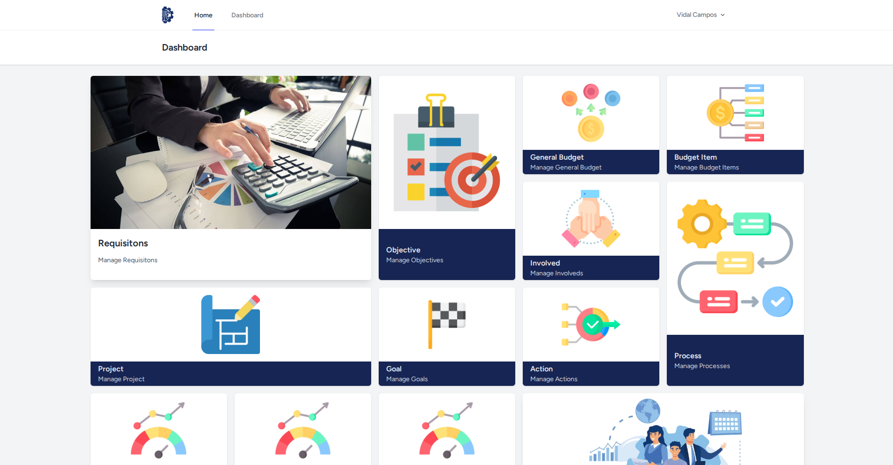

# Programa para el manego de requisiciones en el tecnologico de uruapan.

## Configuración del Entorno de Desarrollo.

Esta seccion contiene los pasos necesarios para configurar tu entorno de desarrollo y comenzar a trabajar en el proyecto.

### Requisitos Previos

#### Instalación de Programas Necesarios

Para desarrollar en Laravel, es necesario contar con varias herramientas y programas:

- **PHP (>= 8.3)**: Laravel requiere PHP 8 o superior.
- **Composer**: El gestor de dependencias para PHP.
- **MySQL/MariaDB**: Base de datos relacional para almacenar los datos del proyecto.
- **Node.js & npm**: Para manejar las dependencias de frontend.
- **Git**: Para clonar y gestionar el repositorio.
- **Laravel Installer (opcional)**: Para iniciar nuevos proyectos Laravel fácilmente.

##### Instrucciones de Instalación

1. **PHP**
   - Para Arch Linux:  
     ```bash
     sudo pacman -S php
     ```
   - Para Mac:  
     Puedes instalar PHP usando [Homebrew](https://brew.sh/):
     ```bash
     brew install php
     ```

2. **Composer**
   - Para Arch Linux:  
     ```bash
     sudo pacman -S composer
     ```
   - Para Windows:
     Descarga e instala Composer desde su [sitio oficial](https://getcomposer.org/).

4. **MySQL/Mariadb**
   - Para Arch Linux:  
     ```bash
     sudo pacman -S mariadb
     ```
   - Para Windows: 
     Instala MySQL desde su [sitio oficial](https://dev.mysql.com/downloads/) o utiliza servicios como **Laragon** (Windows) o **MAMP** (Mac).

6. **Node.js & npm**
   - Para Arch Linux:  
     ```bash
     sudo pacman -S nodejs
     ```
   - Para Windows:  
     Descarga e instala Node.js desde su [sitio oficial](https://nodejs.org/en/).

8. **Git**
   - Para Arch Linux:  
     ```bash
     sudo pacman -S git
     ```
   - Para Windows: 
     Instala Git desde su [sitio oficial](https://git-scm.com/).

10. **Laravel Installer (opcional).**  
      Para instalar el instalador global de Laravel, usa:
      ```bash
      composer global require laravel/installer
      ```
### 2. Empezar a desarrollar.

No importa el sistema operativo que estes usando los pasos son los mismos.

#### 1. Descargar el proyecto.

   - **Clonar el repositorio.**
     ```bash
     git clone git@github.com:hamoncho/requisitions.git
     ```
     Es probable que no puedas clonar este repositorio si todavia no has agregado
     una `ssh` a github.
   
   - **Acceder a la carpeta del proyecto.**
     ```bash
     cd requisitions
     ```
#### 2. Configurar archivo `.env`.

   - **Crear arhivo `.env`.**
     
     El proyecto ya viene con un archivo de ejemplo `.env.example` copielo y cambie el nombre a `.env`.
     
     ```bash
     cp .env.example .env
     ```
   - **Editar `.env`.**
     
     Configura las variables del entorno, como la conexión a la base de datos.
     En el archivo .env, ajusta los valores de las siguientes variables según tu configuración.
     
     ```.env
     DB_CONNECTION=mysql
     DB_HOST=127.0.0.1
     DB_PORT=3306
     DB_DATABASE=nombre_base_datos
     DB_USERNAME=usuario
     DB_PASSWORD=contraseña
     ```

#### 3. Instalar dependencias.

Dentro de la carpeta del proyecto ejecutar:
- **Instalar las dependencias de composer.**
```bach
composer install
```
- **Instala las dependecias de npm.**
```npm
npm install
```
- **Compila el proyecto.**
```npm
npm run build
```
#### 4. Comandos artisan.

- **Generar una `key`.**
```bash
php artisan key:generate
```
- **Generar las tablas de la bases de datos.**
```bash
php artisan migrate
```
- **Llenar las tablas con datos auto generados.**
```bash
php artisan db:seed
```
- **Crea un link a la carpeta publica.**
```bash
php artisan storage:link
```
- **Iniciar el servidor de desarrrollo.**
```bash
php artisan serve
```
Este comando iniciará el servidor y podrás acceder a la aplicación en `http://localhost:8000`.
