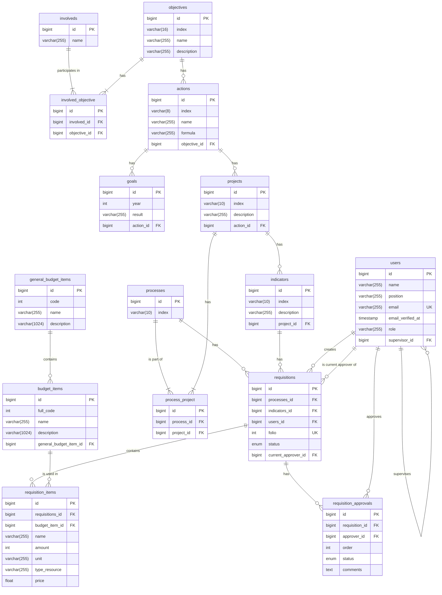

# Diagrama de Entidad-Relación de la Base de Datos

Este archivo contiene el diagrama de la base de datos en formato Mermaid. Puedes visualizarlo usando un editor en línea o extensiones compatibles con Markdown.

## Visualización del Diagrama

Para ver este diagrama, puedes seguir estos pasos:

1.  Copia todo el código que se encuentra dentro del bloque `erDiagram`.
2.  Abre el [Editor en vivo de Mermaid](https://mermaid.live).
3.  Pega el código en el panel de la izquierda (el panel de código).
4.  El diagrama se renderizará automáticamente en el panel de la derecha.

También puedes usar extensiones en tu editor de código (como Visual Studio Code) que soporten la previsualización de diagramas Mermaid en archivos Markdown.

## Código del Diagrama

